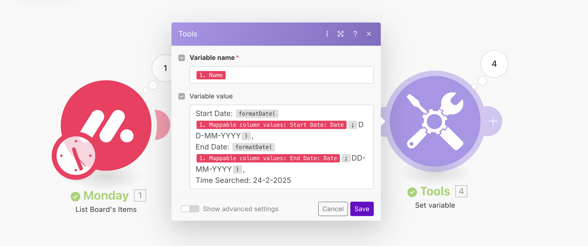

## Task 1: Filter Items Between Dates

**Objective**: Find items where February 24, 2025 falls between `Start Date` and `End Date` using Make.com.  

### Step 1

Make.com calls the Monday API and gets a list of items.
We filter only the column ID's that we need:
- Start Date
- End Date
- Name

### Step 2
A filter lets items pass through based on the conditions:
- Start Date >= 24 Feb AND
- End Date <= 24 Feb

### Step 3
A Set Variable module extracts:
- `Start Date`
- `End Date`
- `Time Searched` (24-02-2025)

(All formated DD-MM-YYYY using `formatDate()`)

