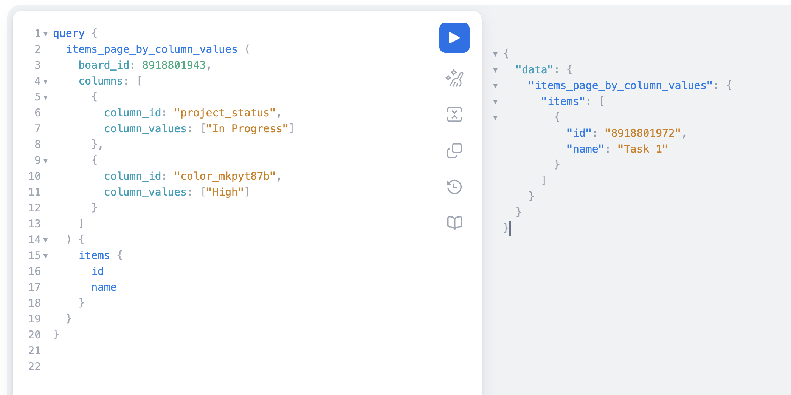

## Task 2: GraphQL Query for Status/Priority

**Objective** Use GraphQL to query Monday.com API for tasks that have status: 'in progress' and priority: 'high'. 

### Input and Output

### Key Components Explained:

1. **`items_page_by_column_values`**  
   - The root query to search for items matching specific column values.  
   - More efficient than fetching all items and filtering client-side.  

2. **`board_id: 8918801943`**  
   - Targets the specific Monday.com board containing the items.  

3. **Column Filters:**  
   - **`project_status` Column:**  
     - Only matches items with status exactly equal to `"In Progress"`.  
   - **`color_mkpyt87b` Column (Priority):**  
     - Uses Monday.com's internal column ID for the priority field.  
     - Filters for items marked as `"High"` priority.  

4. **Returned Fields:**  
   - `id`: The Monday.com item ID
   - `name`: The display name of each matching item.  