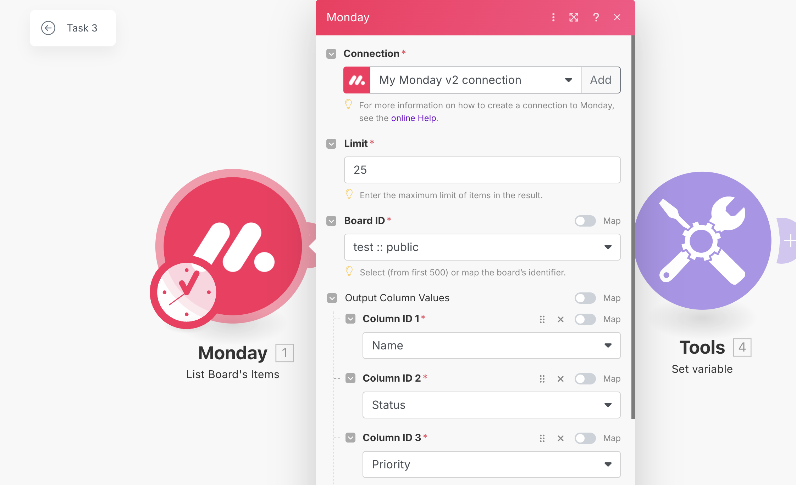
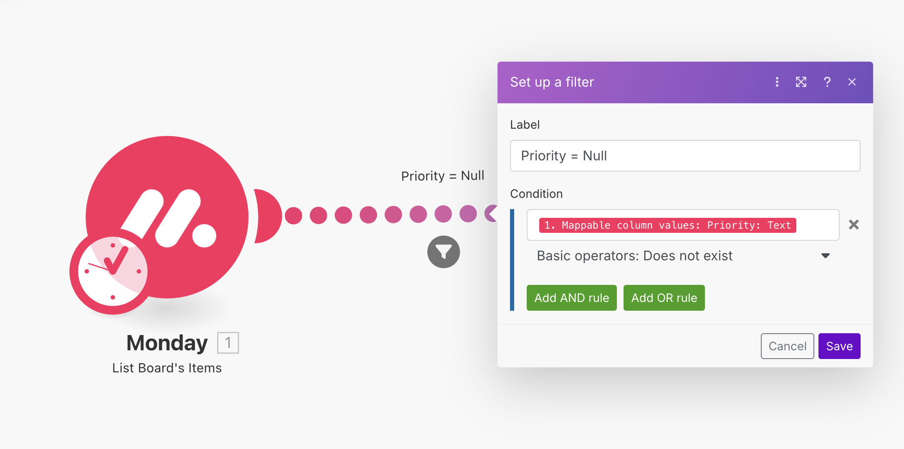
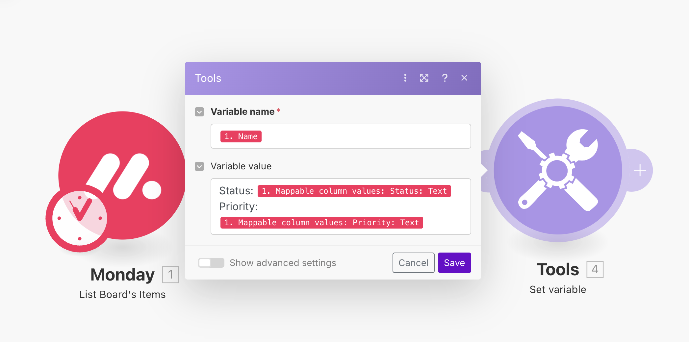

## Task 3: Identifying Null Priorities

**Objective**: Find items without a priority value assigned

### Step 1

Make.com calls the Monday API and gets a list of items.
We filter only the column ID's that we need:
- Name
- Status
- Priority

### Step 2
A filter lets items pass through based on the condition:
- Priority does not exists

### Step 3
A variable setter maps the remaining variable names to:
- Status
- Priority

